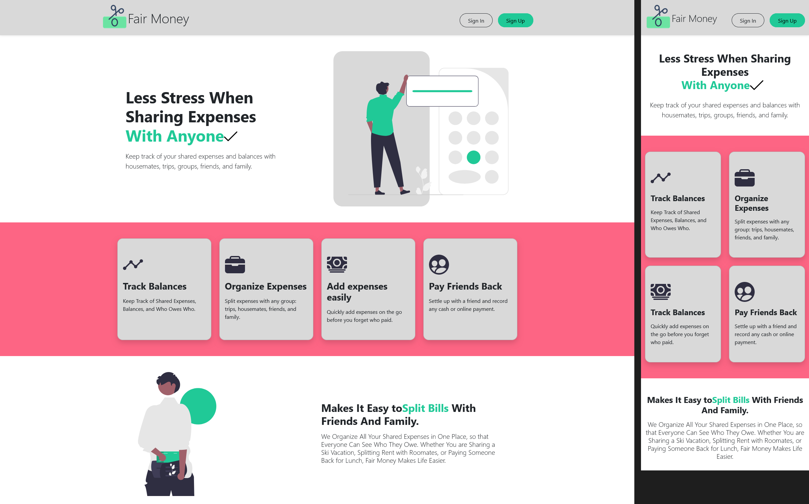
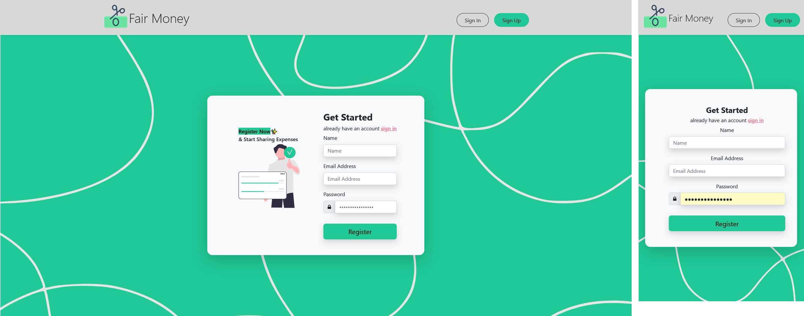
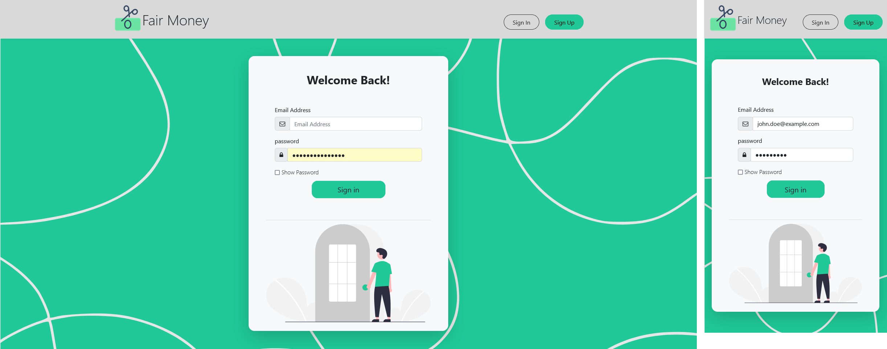
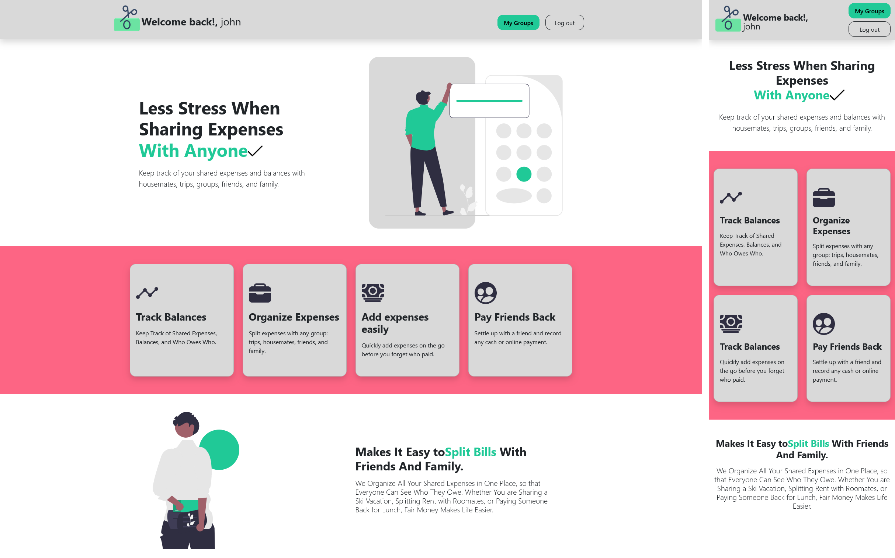
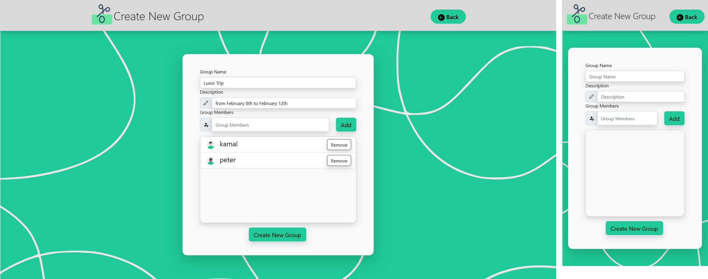
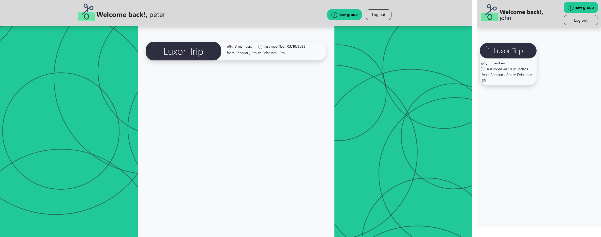
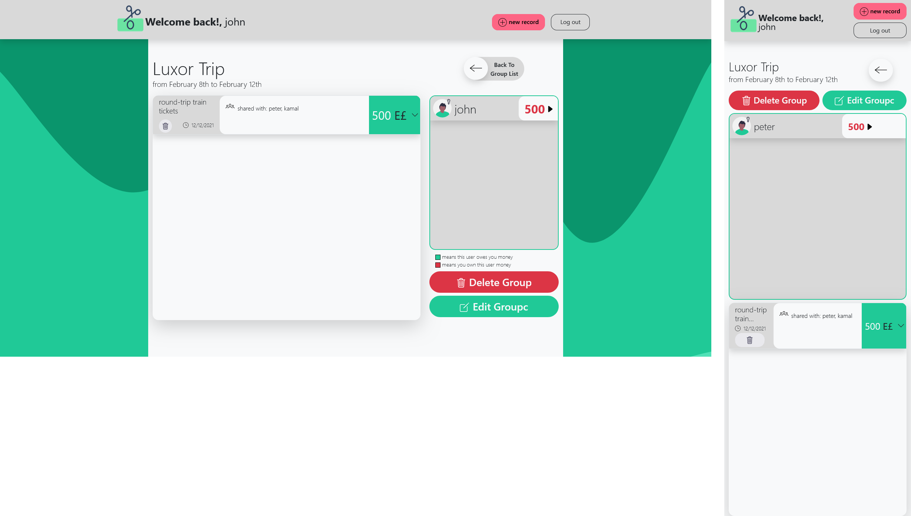
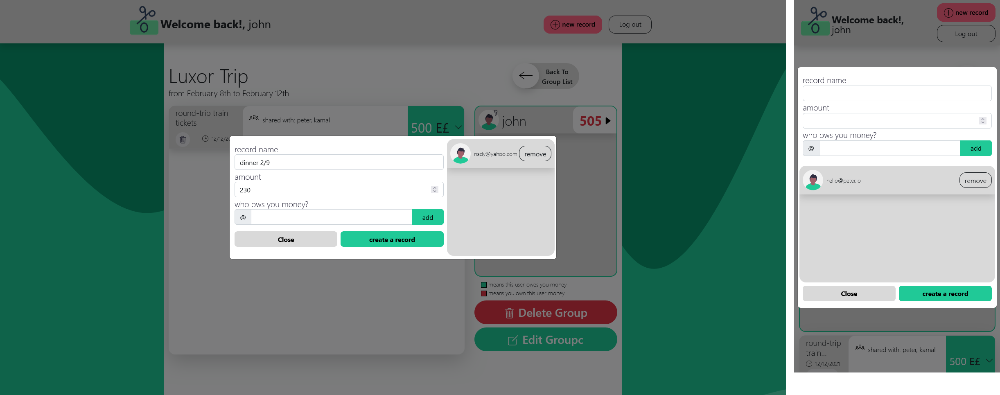

# Fair Money - Shared Expense Tracker

Fair Money is a REST API web application that simplifies the process of tracking shared expenses among friends or groups. Whether you're splitting the cost of a small meal or managing expenses for a big trip abroad, Fair Money makes it easy to keep track of who owes what. You can create groups, add members, and record expenses effortlessly.

## Features

**Group Management**: Create and manage groups for different shared expense scenarios.

**User-Friendly Interface**: Bootstrap is used for styling, ensuring an intuitive and visually appealing user experience.

**Expense Tracking**: Easily add and manage shared expenses within your groups.

**Flexible Member Management**: Add or remove members from a group at any time.

**Authentication:** We've chosen to implement our own custom authentication system to enhance our understanding of security practices. The decision to do so was driven by the desire to learn more about security, making the process both educational and enjoyable. For our website, which functions as a REST API, we've adopted JWT (JSON Web Tokens) as the authentication method of choice.

## Technologies Used

- **Express**: A web application framework for Node.js used for routing and handling server logic.
- **Pug (formerly Jade)**: A templating engine for rendering dynamic HTML templates.
- **MongoDB**: A NoSQL database used for storing user accounts, group data, and expense records.
- **Bootstrap**: A front-end framework for responsive and stylish web design.

# screenshots 📸

















## Getting Started

To get started with Fair Money on your local machine, follow these steps:

1. Clone the repository:

   ```bash
   git clone https://github.com/MoroElMasry/Fair-Money
   ```

2. Navigate to the project directory:

   ```bash
   cd fair-money
   ```

3. Install dependencies:

   ```bash
   npm install
   ```

4. Set up your MongoDB connection
   1. Locate the `config.env` file in the root directory of your project.
   2. Open the `config.env` file and find the MongoDB URI configuration variable. It should look something like this: `DATABASE=your-mongodb-uri`
   3. Replace `your-mongodb-uri` with the actual MongoDB connection URI provided by your MongoDB hosting service or the local MongoDB URL you are using.
   4. Save the `config.env` file.
5. Start the server

   ```bash
   npm install
   ```
